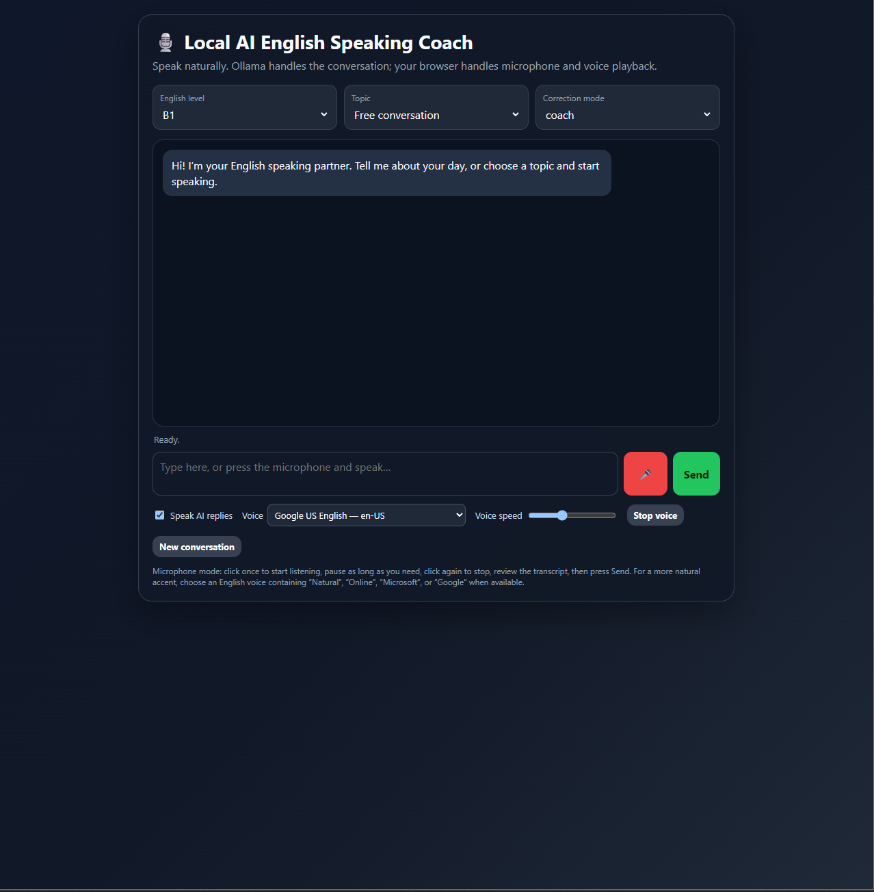
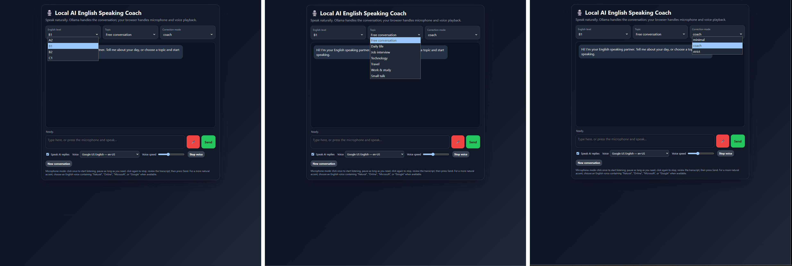

# Local AI English Speaking Coach – Ollama

A local AI English conversation coach built with n8n, Ollama, browser speech recognition, text-to-speech, and conversation memory.

The project is designed for interactive speaking practice with configurable English level, conversation topic, and correction style.

## Screenshots

### Main Interface



### Practice Options



The interface supports CEFR level selection, multiple conversation topics, configurable correction modes, microphone input, text input, browser voice playback, voice selection, and voice-speed control.

## Main Features

- Browser-based microphone and text input
- Transcript review before sending
- English levels from A2 to C1
- Multiple conversation topics
- Minimal, coach, and strict correction modes
- Natural conversational replies
- Grammar, vocabulary, tense, preposition, and naturalness corrections
- Browser text-to-speech for AI replies
- English voice selection and voice-speed control
- Session-based conversation memory
- Local Llama 3 model through Ollama
- Optional legacy local speech-to-text path

## Architecture

```text
Browser Voice/Text Interface
          |
          v
      n8n Webhook
          |
          v
   Message Preparation
          |
          v
English Speaking Coach Agent
       /          \
      v            v
Ollama Llama 3   Conversation Memory
      \            /
       v          v
        Coach Response
              |
              v
     Browser Text + Voice
```

## English Coach Behavior

The agent is configured to:

- Respond naturally to the learner's meaning first
- Keep replies concise and conversational
- Ask follow-up questions
- Adapt language complexity to the selected CEFR level
- Correct important mistakes without turning every reply into a grammar lesson
- Handle likely speech-to-text transcription errors carefully

### Correction Modes

- **minimal** — corrects only important or repeated mistakes
- **coach** — corrects the most important clear mistake in the turn
- **strict** — can correct up to three meaningful mistakes

Corrections can use short patterns such as:

```text
Quick correction:
Why:
More natural:
```

## Voice Input

The primary interface uses browser speech recognition.

The microphone is manually controlled:

1. Click the microphone to start listening.
2. Speak and pause naturally.
3. Click the microphone again to stop.
4. Review the transcript.
5. Press **Send**.

The interface does not automatically send speech after a pause.

## Voice Output

AI replies can be spoken through the browser Speech Synthesis API.

The UI allows:

- English voice selection
- Voice speed control
- Automatic AI reply playback
- Manual stop-voice control

Voice quality depends on the voices available in the user's browser and operating system.

## Local AI Model

The workflow is configured for:

```text
llama3:latest
```

through the n8n Ollama Chat Model node.

The main conversation model runs locally through Ollama and does not require a cloud LLM API key.

## Optional Local Speech-to-Text Path

The workflow also includes a legacy audio-upload path configured for:

```text
http://localhost:8080/inference
```

This is separate from the main browser speech-recognition interface and can be adapted to a local speech-to-text service.

## Requirements

- n8n
- Ollama
- Llama 3
- Chrome or Edge recommended for browser speech recognition
- Browser Speech Synthesis support

## Setup

Install and run Ollama, then pull the configured model:

```bash
ollama pull llama3
```

Import this file into n8n:

```text
local-ai-english-speaking-coach-workflow.json
```

Configure the local Ollama connection in the `Ollama - Llama 3` node, activate the workflow, then open the production webhook for the voice coach page.

## Repository Files

- `local-ai-english-speaking-coach-workflow.json` — sanitized n8n workflow
- `english-coach-interface.png` — main application interface
- `english-coach-options.png` — combined English level, topic, and correction-mode selectors
- `README.md` — project documentation

## Technologies

- n8n
- Ollama
- Llama 3
- AI Agents
- Conversation Memory
- JavaScript
- HTML/CSS
- Webhooks
- Browser Speech Recognition
- Speech Synthesis
- Local AI
- NLP
- Prompt Engineering

## Current Scope

The project provides conversational speaking practice and language correction.

It does **not** currently perform acoustic pronunciation scoring or accent-quality scoring. Browser speech recognition is used to convert spoken input into text.

## Security

The public workflow was checked before upload:

- No API keys
- No passwords
- No credential blocks
- No n8n webhook IDs
- No private email address inside the workflow
- No LAN IP address inside the workflow
- Only localhost endpoints are used for local services

## Author

**Mohammad Ahmad Elayyan**

- Email: [mohamadelayyan84@gmail.com](mailto:mohamadelayyan84@gmail.com)
- LinkedIn: https://www.linkedin.com/in/mohammadelayyan1
- GitHub: [MohammadElayyan117](https://github.com/MohammadElayyan117)
